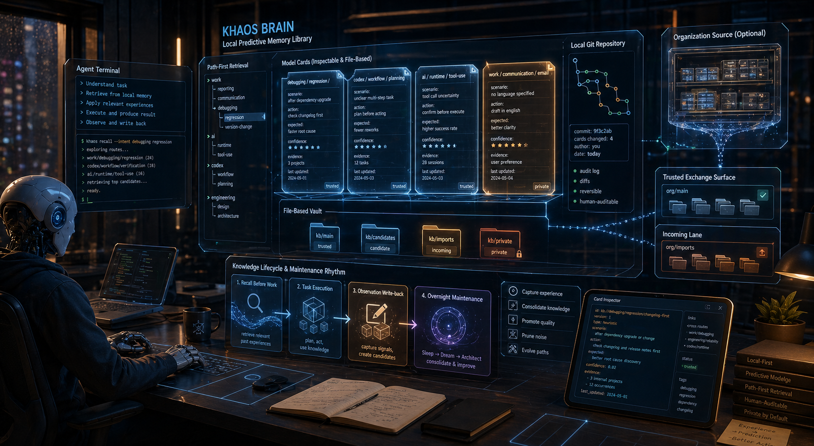
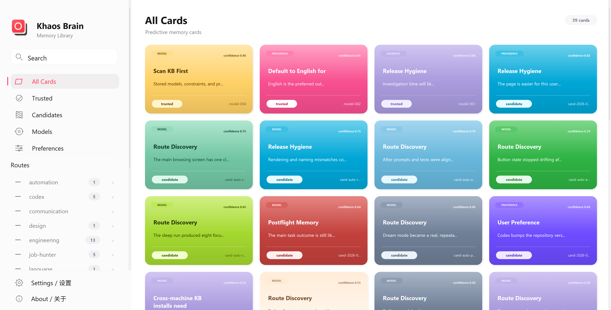
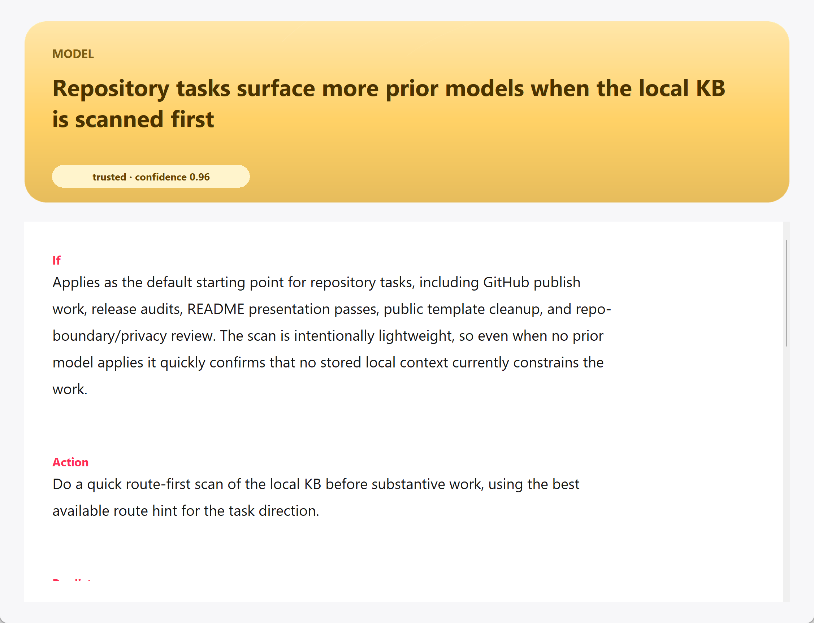

# Khaos Brain

<!-- README HERO START -->
<p align="center">
  
</p>

<p align="center">
  <strong>A local predictive experience layer where every card is an executable LogicGuard argument model.</strong>
</p>
<!-- README HERO END -->

- Repository head (`main`) / 仓库主线（`main`）: `v0.6.5`
- Latest released version / 最新已发布版本: `v0.6.5`
- Project name / 项目名称: `Khaos Brain`
- English lead content comes first; the full Chinese section follows below. / 英文主内容在前，完整中文部分在后方。

<p align="center">
  
</p>

`Khaos Brain` is a local predictive experience layer for AI agents. Instead of saving vague memories, it turns each bounded experience into an executable LogicGuard argument model: a root predictive claim, its context and method, declared evidence and warrant, assumptions, rebuttals, limitations, confidence, provenance, and explicit gaps where support is still missing.

The canonical models and their grounded ModelMeshes live in a local file-backed LogicGuard authority store. Cards stay visible as deterministic YAML projections, so people can search, review, diff, consolidate, roll back, and optionally share them without making YAML a second semantic authority. The current release is Codex-first, with installer-managed skills, global defaults, and local maintenance automations already wired for Codex; the design can be adapted to any host agent that supports preflight retrieval, post-task write-back, local scripts, reusable workflows, scheduled maintenance, and Git.

It does not save vague memories such as "remember this next time." It stores bounded model cards: the situation, the action under consideration, the predicted or observed result, confidence, source, status, and how an agent should use that lesson later.

- It turns "remember this" into a LogicGuard model whose conclusion, support, assumptions, counterarguments, boundaries, and missing evidence can be inspected separately.
- It keeps agent memory local, file-based, Git-versioned, and inspectable instead of hiding it in an opaque memory service.
- It gives memory a fully automatic maintenance rhythm: exact-model retrieval/write-back, incremental Sleep model consolidation, immutable Dream pressure tests, system updates, and optional organization maintenance.
- It makes Skill sharing more useful by pairing a Skill with the experience card that explains when and why to use it.

## Product Preview

| Local + Organization Cards | Organization Source | Card Detail |
| --- | --- | --- |
|  |  |  |

## How It Works

The everyday loop is:

`Khaos Brain` is a local predictive experience system for AI agents. It does not only store memories; it organizes task experience, predictive models, user preferences, runtime lessons, and shareable Skills into exact LogicGuard models with visible Git-versioned card projections:

- the situation where a lesson applies;
- the action or route that was taken;
- the predicted or observed result;
- the weaker route that failed, when that contrast matters;
- the evidence and warrant that support the prediction;
- the assumptions, rebuttals, limitations, and still-missing support;
- source, author, status, confidence, and review metadata;
- skill or workflow dependencies when a lesson depends on a reusable capability.

The result is a model library that is local-first, executable, inspectable, searchable, reviewable, mergeable, reversible, and friendly to Git history.

The authority boundary is strict:

- `.local/khaos-brain/logicguard-authority/` owns exact model and ModelMesh revisions;
- `kb/public/`, `kb/private/`, and `kb/candidates/` contain deterministic readable projections;
- the active index binds every hit to an exact generation, model, root ArgumentBlock, and mesh revision;
- retrieval may expand only grounded ModelMesh edges, never legacy `related_cards` or mere co-use;
- missing exact authority fails visibly—there is no YAML or floating-head fallback.
- distinct cards in the same exact generation and authority scope reuse one immutable ModelMesh view; publishing a new generation clears the old read session, and release readiness checks both real local scale and the generalized distinct-card case.

## What A Card Contains

| Card field | Why it matters |
| --- | --- |
| Situation | When the lesson applies |
| Action | What route, tool, skill, or decision should be considered |
| Predicted or observed result | Why the card is useful |
| Confidence and status | Whether the card is candidate, trusted, weak, stale, or under review |
| Source and author | Where the lesson came from |
| Contrast | What weaker route failed, when that matters |
| Skill dependency | Which reusable workflow or skill the card depends on |
| Operational guidance | How a future agent should use it |

This makes memory inspectable instead of opaque.

Khaos Brain turns those details into machine-auditable LogicGuard nodes, edges, ArgumentBlocks, gaps, and receipts rather than opaque vector-only memory. AI maintenance reads the lifecycle ledger, evidence, rollback records, and receipts automatically; the desktop viewer is optional and is not part of the completion gate.

Personal mode is the default. Each machine keeps its own local KB, including private preferences, local context, and local skill-use evidence.

The system follows a brain-like rhythm:

- **Awake work:** the agent retrieves relevant experience before a task and writes one caller-identified observation afterward. Postflight performs one durable append plus an event-bound terminal receipt; it never replays the full lifecycle or publishes models/indexes synchronously.
- **Sleep consolidation:** `KB Sleep` is the sole canonical writer. It turns every admitted entry into an exact LogicGuard revision, audits missing support and opposition, assembles grounded scoped ModelMeshes, and atomically publishes models, meshes, projections, and the active index as one generation.
- **Dream verification:** `KB Dream` pins an exact immutable generation and pressures evidence, assumptions, rebuttals/counterexamples, and boundaries. It can only send typed model-gap handoffs to Sleep and must prove canonical authority unchanged.
- **Manual software update:** the desktop reports exact upstream status, and the transactional updater runs only after an explicit user request to AI in the current conversation; there is no scheduled update task.
- **Organization maintenance:** shared organization sources have their own candidate, review, and maintenance path.
- **Independent completion:** each of the four scheduled tasks and the separate manual-update Skill owns its own native route, non-overlapping obligations, tests, evidence, and immutable run receipt. SkillGuard checks those five source Skills only in the maintainer repository; installed Skills complete their work without SkillGuard, shared receipts, or external closure.

After installation, scheduled maintenance runs through four local automations without requiring a human review queue. The installation and operator-activation inventory always names all five maintained Skills, then classifies Sleep, Dream, organization contribution, and organization maintenance as scheduled while classifying only `khaos-brain-update` as manual-only. Task preflight and postflight keep retrieval and evidence write-back close to ordinary work, while Sleep, Dream, and organization maintenance improve the library over time; software update remains user-invoked.

### Personal Mode And Organization Mode

Personal mode is the default. Each machine maintains its own local KB, preserving private preferences, local context, and local skill-use evidence.

Organization mode is optional. After Settings validates a Khaos organization KB GitHub repository, the desktop UI enables organization sources, organization cards, organization skill registry, and contribution / maintenance flows.

The boundary is intentional:

- personal preferences stay local by default;
- reusable task models and engineering lessons can enter an organization candidate pool;
- organization cards carry source, author, status, confidence, and read-only metadata;
- local retrieval remains first;
- organization cards become local experience only after actual use;
- meaningful local improvements can flow back as reviewed organization candidates.

## Organization Sharing Is More Than Skill Sharing

Khaos Brain can share Skills, but the important layer is the experience model that explains why a Skill exists.

An organization card can say:

- which task class the lesson applies to;
- which route or action to use;
- what outcome it predicts;
- who authored it and how confident it is;
- whether it depends on a Skill bundle.

Candidate Skills are not auto-installed. Only approved Skills with pinned version and content-hash metadata are eligible for installation on another machine.

## Why GitHub Is Enough For An Organization KB

An organization shared KB can be a private GitHub repository:

- no separate memory server to deploy;
- existing GitHub permissions, branches, review, Actions, and rollback;
- cards, candidates, import records, and skill registries remain inspectable files;
- automation can submit proposals while GitHub handles history and review;
- bad automation changes can be reverted through ordinary Git.

For many teams, a private repository is already the simplest reliable backend for shared agent memory.

## Install And Check

The Python dependency set pins one exact public [ResearchGuard v0.1.1](https://github.com/liuyingxuvka/ResearchGuard/releases/tag/v0.1.1) source commit. Khaos Brain imports only its `researchguard.logic` member, which owns the required ModelStore and ModelMesh APIs and the current `researchguard.logic.model-store.v1` / `researchguard.logic.model-mesh.v1` schemas. The retired standalone LogicGuard package is neither installed nor consulted.

Repository contributors and GitHub Actions use `requirements-dev.txt`, which additionally pins the public [FlowGuard v0.58.4](https://github.com/liuyingxuvka/FlowGuard/releases/tag/v0.58.4) source commit used by model-assurance tests. ResearchGuard and FlowGuard both use one exact public HTTPS source identity; there is no SSH key, private dependency, mirror, alias, compatibility import, fallback, or alternate dependency path. Khaos Brain keeps its FlowGuard project record and executable models but does not vendor a FlowGuard shadow Skill suite, ownership manifest, suite map, or compatibility verifier; Codex uses the current global FlowGuard Skill surface. CI also uses the public SkillGuard source for author-side contract compilation and depth calibration and uses official OpenSpec 1.6.0 for specification verification. Neither tool is copied into Khaos Brain's installed consumer Skills or required by their normal execution. Each native runner uses the current Python identity recorded by its own command contract; a real interpreter change invalidates that runner's evidence.

- **Visible:** cards can be opened directly; source, author, confidence, status, and skill dependencies are visible.
- **Maintainable:** incremental Sleep, convergent Dream, system update, and organization maintenance treat memory as a living system.
- **Local-first:** organization mode does not overwrite personal memory.
- **Organization-ready:** teams can share routes, lessons, maintenance methods, and reviewed skills.
- **Git-native:** history, diff, review, rollback, private access, and automation can reuse GitHub.
- **Open and customizable:** structure, cards, scripts, skills, and UI are files and source code.
- **Honest automation:** shared knowledge still moves through candidates, review, maintenance, and rollback.

- download `KhaosBrain.exe` from [GitHub Releases](https://github.com/liuyingxuvka/Khaos-Brain/releases/latest);
- run the installer or repository setup for the local skill/runtime path used by your agent;
- run the health check before relying on retrieval.

Repository-local check:

```powershell
python scripts\install_codex_kb.py --check --json
```

Desktop viewer:

```powershell
python scripts\open_khaos_brain_ui.py
```

## What Kind Of AI Agent It Needs

The out-of-the-box host is Codex because Codex supports:

- repository-level instructions such as `AGENTS.md`;
- skills and preflight invocation;
- local script execution;
- automations and scheduled runs;
- GitHub and filesystem workflows;
- post-task observation and write-back.

Another AI host can adapt the structure if it can read experience before work, write evidence afterward, load reusable workflows, run local maintenance scripts, and safely read/write Git repositories.

## Public Boundary

This public repository contains the Khaos Brain source code, examples, schemas, installer/check scripts, UI assets, screenshots, public-safe Skill material, and empty KB scaffolding.

It does not contain a user's private KB, real local history, credentials, private candidate cards, personal preferences, organization secrets, live customer data, or unpublished local memory. Public screenshots use safe demo content.

## Repository Layout

```text
local_kb/              Core package, retrieval, cards, maintenance, desktop UI
.agents/skills/        Codex skills for retrieval, maintenance, organization flow, and UI launch
kb/                    Public-safe KB scaffold and taxonomy example
schemas/               Example card/schema files
scripts/               Install, check, launch, and maintenance helpers
templates/             Template artifacts
assets/                Icons, screenshots, and README hero assets
docs/                  Architecture, maintenance, organization, release, and UI docs
tests/                 Regression tests
VERSION                Current public version
CHANGELOG.md           Release history
```

## License

MIT. See [`LICENSE`](./LICENSE).

After the check passes, the machine has the global preflight skill, bounded postflight rules, four scheduled maintenance entries (`KB Sleep`, `KB Dream`, organization contribution, and organization maintenance), plus the manually invoked `khaos-brain-update` Skill. There is no scheduled software-update task. The desktop UI only displays the exact configured Git upstream status; updating starts only when the user explicitly asks AI in the current conversation. Each installed Skill is a self-contained consumer product with its own native checks and receipts; no installed tree contains `.skillguard` or calls SkillGuard. Upgrades remove the retired Architect and system-update surfaces and settle old history, candidate, cache, sandbox, and maintenance debt. Old managed formats are upgrade-only input: the AI-run transaction converts them directly into exact LogicGuard models, scoped ModelMeshes, deterministic projections, and an exact active index, publishes the generation pointer last, deletes retired authority, and requires a residual-zero receipt. Normal operation has no compatibility layer or projection fallback; missing or stale current facts fail visibly. Upgrade-attempt currentness reads one bounded `HEAD.json` and the exact bounded current projection it names; immutable event history and prior attempt directories are never scanned by the ordinary check. The committed lightweight install state binds that same final attempt by exact ID and receipt hash, and an independent post-command check must match both. During a real manual update, all four scheduled automations remain paused while one target-native transaction validates, restores, reads back, runs the normal install check, and marks the update current.

The exact migration phases, rollback behavior, pause-state preservation, and success gates are documented in [Chaos Brain upgrade contract](docs/chaos_brain_upgrade.md).

# Khaos Brain 中文说明

| 仓库主线 | 最新发布 | 项目 | 许可证 |
| --- | --- | --- | --- |
| `v0.6.5` | `v0.6.5` | `Khaos Brain` | MIT |

## 它是什么

Khaos Brain 是给 AI agent 用的本地预测经验系统。

它不是保存一句“下次记得这样做”的浅层记忆，而是保存有边界的 model cards：适用场景、可考虑的动作、预测或观察到的结果、信心、来源、状态，以及未来 agent 应该怎么使用这条经验。

这些 card 都是可见文件。它们可以被搜索、审查、diff、合并、回滚，也可以选择性通过 organization repository 共享。个人记忆默认留在本地。

当前实现是 Codex-first：installer-managed skills、global defaults、本地维护 automations 和 desktop viewer 已经接到 Codex。只要另一个 host agent 支持 preflight retrieval、post-task write-back、本地脚本、可复用 workflow、定时维护和 Git，也可以适配这个结构。

## 为什么需要它

AI agent 经常从很浅的上下文重新开始：

1. agent 以前做过类似任务，但经验埋在聊天历史里。
2. 用户偏好只是一句话，不是 condition/action/outcome pattern。
3. 某条路线成功过，但没人知道什么时候该复用。
4. 错路反复出现，因为修正没有变成可复用 warning。
5. 团队知识要么太私有、不可见，要么共享时没有 review 和 provenance。

Khaos Brain 把重复工作变成可维护经验。

## 产品预览

| 本地 + 组织 Cards | 组织来源 | Card Detail |
| --- | --- | --- |
|  |  |  |

## 它怎么工作

日常循环是：

```text
.
├─ AGENTS.md
├─ CHANGELOG.md
├─ PROJECT_SPEC.md
├─ README.md
├─ VERSION
├─ docs/
├─ .agents/
├─ .local/khaos-brain/logicguard-authority/  # exact local model/mesh generations
├─ kb/                                      # readable projections + history/taxonomy
├─ local_kb/                                # model, projection, retrieval, maintenance runtime
├─ schemas/
├─ scripts/
├─ templates/
└─ tests/
```

翻成人话：

- **Preflight search** 在任务开始前检索相关 local / organization cards。
- **Postflight write-back** 在任务结束后记录经验、miss、修正和可复用模式。
- **Sleep** 合并重复或过大的 card。
- **Dream** 探索附近机会和弱信号，但不把它们当成可信事实。
- **System Update** 只处理经过授权的软件更新；模型整理仍由 Sleep 独占。
- **Organization mode** 让 reviewed cards 和 skill bundles 可以通过共享仓库流转，同时默认不暴露私人本地记忆。

`Khaos Brain` 是一个给 AI agent 使用的本地预测型经验层。它不只是保存一句“下次记得这样做”，而是把每条有边界的经验写成一个可执行的 LogicGuard 论证模型：根预测结论、适用情境、方法、证据、论证桥梁、假设、反驳、边界、可信度、来源，以及仍然缺少什么支持。

真正的语义权威保存在本地文件型 LogicGuard model / ModelMesh store 中；卡片仍然是可见的确定性 YAML 投影，可以搜索、审查、diff、整理、回滚，也可以通过可选的组织仓库共享可复用经验，但 YAML 不再是第二套权威。当前版本首先集成 Codex：安装器、全局 Skill、`AGENTS.md` 默认规则和本地维护自动化都已经接好；但只要宿主 agent 能在任务前检索、任务后写回、运行本地脚本、加载可复用工作流、做定期维护并读写 Git 仓库，同样结构也可以迁移。

这让 memory 可检查，而不是黑箱。

- 它把“下次记得这样做”变成 LogicGuard 模型，把结论、证据、论证桥梁、假设、反例、边界和缺口分开表达。
- 它把 agent 记忆保留为本地、文件化、Git 可追踪、可审查的结构，而不是藏在黑盒记忆服务里。
- 它让记忆有全自动维护节律：任务前进入精确模型、任务后写回观察，随后由 Sleep 整理模型、Dream 做不可变压力测试、系统更新和可选组织维护继续收敛。
- 它让 Skill 共享更有上下文：共享的不只是脚本，还有说明“什么时候该用、为什么该用”的经验卡片。

Personal mode 是默认模式。每台机器保留自己的 local KB，包括私人偏好、本地上下文和本地 skill-use evidence。

Organization mode 是可选的。Settings 验证 organization KB GitHub repository 后，desktop UI 会启用 organization sources、organization cards、organization skill registry，以及 contribution / maintenance flows。

有用的 agent memory 需要条件、动作、结果、可信度、来源和维护节律。它还应该知道哪些经验是私人的，哪些可以共享，哪些只是候选，哪些重复失败应该沉淀成更强路线。

- 在什么条件下
- 采取什么动作
- 更可能得到什么结果
- 哪条路线失败过，哪条路线更稳
- 这个经验来自谁、哪个来源、是否已经被信任
- 如果一个 Skill 很关键，它到底在哪类任务里有用

`Khaos Brain` 把这些内容做成 LogicGuard 模型，并生成人能阅读的卡片投影。它不是黑盒向量，不是散乱笔记，也不是只能靠人手维护的规则列表。每个检索结果都绑定精确 generation、model revision、根 ArgumentBlock 和 mesh revision；缺少精确权威就明确失败，不回退读取 YAML 或浮动最新版本。同一精确 generation、同一权限范围内的不同卡片共用一个不可变 ModelMesh 读取视图；发布新 generation 会清除旧读取会话，发布验收同时检查真实本地规模和“不同卡片共用当前 mesh”的同类案例。

### 为什么它像一个“脑”

系统刻意采用脑式节律：

- **醒着做任务：** agent 在任务前检索相关经验，在任务后用一个稳定事件 ID 写回一条观察。Postflight 只做一次持久写入和事件绑定终态回执，不同步重放完整生命周期，也不发布模型或索引。
- **睡眠整理：** `KB Sleep` 是唯一正常运行时模型写入者。它把每条经验整理成精确 LogicGuard revision，检查证据、warrant、假设、反驳和边界缺口，再把模型、ModelMesh、卡片投影和索引作为一个 generation 原子发布。
- **快速而守门的检索：** 日常查询先用路线和词法找到入口，再读取精确模型、根 ArgumentBlock、缺口和已验证的 mesh 邻域；`related_cards`、共同出现或 YAML 投影都不能授权扩展。
- **做梦验证：** `KB Dream` 固定一个不可变 generation，测试移除证据、移除假设、加强反驳/反例和压力边界；它只能把模型缺口交给 Sleep，并且结束前必须证明权威没有被改写。
- **手动软件更新：** 桌面只显示精确上游状态；只有用户在当前对话里明确要求 AI 更新时，事务式更新流程才会运行。系统没有软件自动更新计划任务。
- **组织维护：** 共享组织来源有自己的 candidate、review 和 maintenance 路径。
- **独立完成：** 四个计划任务与单独的手动更新 Skill 各自拥有自己的原生路线、不重叠的职责、测试、证据和不可变运行回执。SkillGuard 只在维护者仓库里检查这五个源技能；安装后的技能不依赖 SkillGuard、共享回执或外部闭环。

安装后，四个本地 automations（Sleep、Dream、organization contribution、organization maintenance）全自动运行，不要求人工阅读文件或维护 review queue。任务 preflight/postflight 负责检索与有界证据写回；软件更新保持当前对话显式调用。

### 个人模式和组织模式

个人模式是默认模式。每台机器维护自己的本地 KB，保留私人偏好、本地上下文和本地 skill-use evidence。

组织模式是可选的。Settings 验证一个 Khaos organization KB GitHub 仓库后，桌面 UI 会启用 organization sources、organization cards、organization skill registry，以及 contribution / maintenance flows。

边界是故意这样设计的：

- personal preferences 默认留在本地；
- 可复用任务模型和工程经验可以进入 organization candidate pool；
- organization cards 带有 source、author、status、confidence 和 read-only metadata；
- local retrieval 仍然优先；
- organization card 只有在真实使用后才会变成本地经验；
- 有意义的本地改进可以作为 reviewed organization candidate 回流。

## 组织共享不只是共享 Skill

Khaos Brain 可以共享 Skills，但更重要的是解释“为什么需要这个 Skill”的 experience model。

organization card 可以说明：

- 适用的任务类型；
- 应该使用的 route 或 action；
- 预测什么结果；
- 谁写的、可信度如何；
- 是否依赖一个 Skill bundle。

Candidate Skills 不会自动安装。只有带 pinned version 和 content-hash metadata 的 approved Skills，才有资格安装到另一台机器。

## 为什么 GitHub 足够作为组织 KB

组织共享 KB 可以就是一个 private GitHub repository：

- 不需要另起 memory server；
- 直接使用 GitHub permissions、branches、review、Actions 和 rollback；
- cards、candidates、import records 和 skill registries 都是可检查文件；
- 自动维护可以提交 proposals，GitHub 负责 history 和 review；
- 如果自动化改坏了，可以用普通 Git 历史回滚。

对很多团队来说，private repository 已经是最简单可靠的共享 agent memory backend。

## 安装和检查

Python 依赖只固定到一个公开的 [ResearchGuard v0.1.1](https://github.com/liuyingxuvka/ResearchGuard/releases/tag/v0.1.1) 精确源码提交。Khaos Brain 只导入其中的 `researchguard.logic` 成员；当前 ModelStore、ModelMesh API 以及 `researchguard.logic.model-store.v1` / `researchguard.logic.model-mesh.v1` schema 都由它提供。已经退役的独立 LogicGuard 包既不安装，也不参与运行。

仓库开发与 GitHub Actions 使用 `requirements-dev.txt`，其中额外固定了公开的 [FlowGuard v0.58.4](https://github.com/liuyingxuvka/FlowGuard/releases/tag/v0.58.4) 精确源码提交，用于模型保障测试。ResearchGuard 和 FlowGuard 都只走一个公开 HTTPS 身份；没有 SSH 密钥、私有依赖、镜像、别名、兼容导入、fallback 或第二依赖路径。Khaos Brain 只保留 FlowGuard 项目记录和本项目的可执行模型，不再内置 FlowGuard 影子 Skill 套件、ownership manifest、suite map 或兼容验证器；Codex 使用当前全局 FlowGuard Skill 入口。CI 也会使用公开的 SkillGuard 源码做作者侧合同编译与深度校准，并使用官方 OpenSpec 1.6.0 做规格验证。它们都不会被复制进 Khaos Brain 的消费者安装技能，也不是这些技能日常运行的依赖。每个原生运行器只服从自己的命令合同；解释器身份真正变化时，该运行器的证据会失效。

对很多团队来说，private repository 已经是最简单可靠的 memory backend。

### 为什么它比普通 AI 记忆产品更值得试

- **可见：** card 可以直接打开，source、author、confidence、status、skill dependencies 都可见。
- **可维护：** 增量 Sleep、收敛式 Dream、system update 和 organization maintenance 把 memory 当成活系统。
- **本地优先：** organization mode 不覆盖个人记忆。
- **组织可用：** 团队共享 route、lesson、maintenance method 和 reviewed skill。
- **Git-native：** history、diff、review、rollback、private access 和 automation 都可以复用 GitHub。
- **开放可定制：** structure、cards、scripts、skills、UI 都是文件和源码。
- **诚实自动化：** 高价值共享知识仍然要经过 candidates、review、maintenance 和 rollback。

### 它依赖什么样的 AI agent

当前开箱 host 是 Codex，因为 Codex 支持：

- `AGENTS.md` 这样的 repository-level instructions；
- skills 和 preflight invocation；
- local script execution；
- automations 和 scheduled runs；
- GitHub 和 filesystem workflow；
- post-task observation 和 write-back。

其他 AI host 如果能在任务前读取经验、任务后写回证据、加载 reusable workflow、运行本地维护脚本，并安全读写 Git 仓库，也可以适配这套结构。

### 如果你只是想使用它

最自然的路径是把这个仓库交给 AI agent，并说：

```text
Install and enable this Khaos Brain experience system on this machine, then run the health check.
```

Codex 会按仓库规则运行：

```bash
python scripts/install_codex_kb.py --json
python scripts/install_codex_kb.py --check --json
```

检查通过后，这台机器会安装 global preflight skill、有界 postflight rules、四个计划维护入口（`KB Sleep`、`KB Dream`、organization contribution、organization maintenance），以及只能由当前对话显式调用的 `khaos-brain-update` Skill。系统没有软件自动更新计划任务；桌面 UI 只显示精确配置的 Git 上游是否有新版本，不写入授权，也不启动更新。每个安装技能都是能够独立工作的消费者产品，拥有自己的原生检查与回执；安装树里不含 `.skillguard`，运行时也不调用 SkillGuard。旧电脑升级时会删除已退役的 Architect 与 system-update 精确受管表面，并清理历史经验债务与维护债务。旧受管格式只允许作为升级输入：AI 事务直接生成当前 LogicGuard models、分域 ModelMeshes、确定性卡片投影和精确 active index，最后发布 generation pointer、删除旧权威并要求残留为零。日常运行没有兼容层、YAML 语义 fallback 或浮动 head；缺少或过期的当前事实会明确失败。轻量安装状态还必须用精确 attempt ID 和回执哈希绑定同一个最终升级尝试，独立检查会在安装器退出后重新核对二者。真实手动更新期间，四个计划任务会保持暂停，由一次目标原生事务完成校验、恢复、回读、普通安装检查并把更新状态标记为当前。

完整迁移阶段、失败回滚、暂停状态保留和成功门槛见 [Chaos Brain 升级契约](docs/chaos_brain_upgrade.md)。

### 桌面卡片查看器

Windows Release 包含预览版 `KhaosBrain.exe`：

- 从 [GitHub Releases](https://github.com/liuyingxuvka/Khaos-Brain/releases/latest) 下载 `KhaosBrain.exe`；
- 按你的 agent 使用的本地 skill/runtime 路径运行安装或仓库 setup；
- 依赖 retrieval 前先运行 health check。

仓库本地检查：

```powershell
python scripts\install_codex_kb.py --check --json
```

Desktop viewer：

```powershell
python scripts\open_khaos_brain_ui.py
```

## 它需要什么样的 AI Agent

开箱支持的 host 是 Codex，因为 Codex 支持：

- `AGENTS.md` 这类仓库级说明；
- skills 和 preflight invocation；
- 本地脚本执行；
- automations 和 scheduled runs；
- GitHub / filesystem workflows；
- post-task observation 和 write-back。

其他 AI host 如果能在工作前读取经验、工作后写回证据、加载可复用 workflow、运行本地维护脚本，并安全读写 Git 仓库，也可以适配这个结构。

## 公开边界

这个公开仓库包含 Khaos Brain 源码、示例、schemas、安装/检查脚本、UI assets、screenshots、public-safe Skill material 和空 KB scaffold。

它不包含用户私人 KB、真实本地 history、credential、私人 candidate cards、个人偏好、组织 secret、真实客户数据或未公开本地记忆。公开 screenshots 使用安全演示内容。

## 仓库结构

```text
.
├─ AGENTS.md
├─ CHANGELOG.md
├─ PROJECT_SPEC.md
├─ README.md
├─ VERSION
├─ docs/
├─ .agents/
├─ .local/khaos-brain/logicguard-authority/  # 本机精确 model/mesh generations
├─ kb/                                      # 可读投影、历史与 taxonomy
├─ local_kb/                                # 模型、投影、检索与维护运行时
├─ schemas/
├─ scripts/
├─ templates/
└─ tests/
```

## 许可证

MIT. See [`LICENSE`](./LICENSE).
