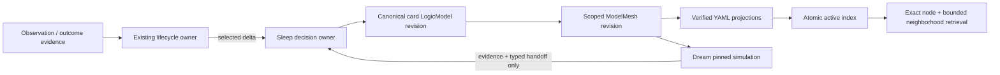

## Context

Khaos Brain already has mature owners for observation/candidate lifecycle, active-index publication, Sleep watermarking, Dream handoff, canonical-versus-localized interfaces, desktop card rendering, maintenance lanes, and transactional upgrade. Existing FlowGuard/BCL lookup identifies `kb_convergence_upgrade_model.LifecycleConvergenceBlock` as the current retrieval/lifecycle owner and `khaos_brain_governance_flow.GovernanceBlock` as the Sleep/Dream governance owner. LogicGuard is a new argument-runtime dependency, not a replacement lifecycle scheduler.

The current YAML card shape (`if`, `action`, `predict`, `use`, `related_cards`) is useful for humans but structurally shallow. LogicGuard 0.17.4 supplies immutable `FileModelStore` revisions, canonical `ArgumentBlock`s, typed provenance, exact revision identities, `FileModelMeshStore`, mesh memberships/cross-model edges, materialization, structural evaluation, and sparse simulation. The upgrade must use those public APIs and preserve their revision/CAS semantics.

The repository contains a large dirty worktree from earlier authorized work. This change must preserve unrelated and prior in-scope changes, add isolated modules, extend existing public entrypoints, and never recover an earlier green state by resetting peer/user files.

## Goals / Non-Goals

**Goals:**

- Make a canonical LogicGuard model revision the only semantic authority for every current Khaos Brain card.
- Preserve simple card reading by projecting the model back into familiar human fields.
- Let many small card models become larger logical structures through revision-pinned ModelMesh memberships and edges.
- Make Sleep inspect and improve model completeness and make Dream validate/deepen the model with counterexamples without gaining write authority.
- Make exact card hits automatically open a bounded model neighborhood and allow direct model/node lookup.
- Migrate every existing managed card atomically with zero normal-runtime compatibility or fallback.
- Preserve lifecycle, privacy, scheduling, UI, and upgrade ownership already present in Khaos Brain.

**Non-Goals:**

- Do not replace LogicGuard with a Khaos-specific graph format or mini framework.
- Do not make LogicGuard own observation admission, candidate decisions, Sleep scheduling, Dream scheduling, retrieval policy, privacy policy, or desktop UI policy.
- Do not merge every card into one enormous `LogicModel`; the global structure is a mesh of small revisioned models.
- Do not invent evidence, warrants, rebuttals, or causal claims during migration. Unknown support becomes an explicit gap.
- Do not add a graph database, vector database, service daemon, or background-agent orchestration.
- Do not preserve old fields as a second current authority.

## Decisions

### 1. One predictive card is one small canonical argument model

Each active or candidate predictive unit owns one stable `LogicModel` id and one root `ArgumentBlock`. The block's root claim is the card's predicted result. Its members may include:

| Predictive meaning | LogicGuard representation |
| --- | --- |
| Situation / trigger (`if`) | `Context` and/or `Premise` nodes |
| Recommended behavior (`action`) | `Method` node plus a scoped `Claim` when the action itself is asserted |
| Expected result (`predict`) | root `Claim` node |
| Why it is expected | `Warrant` node |
| Observed support | `Evidence`/`Result` nodes with typed provenance |
| Operational use (`use`) | `Qualifier`, `Context`, or projection metadata; never evidence by itself |
| Preconditions | `Assumption` nodes |
| Counterexamples | `Rebuttal`/`Undercutter` nodes |
| Where it stops applying | `Limitation`/`Qualifier` nodes |

The minimum migratable model contains context/premise, method/action, root claim, and an explicit support-status/gap record. A migration MUST NOT manufacture a warrant or evidence merely to satisfy a shape. Strong promotion requires the richer role coverage defined by LogicGuard diagnostics and Khaos lifecycle policy.

Alternative rejected: keep YAML canonical and attach an optional LogicGuard model. That creates two authorities and makes missing/stale models invisible.

### 2. YAML is a verified projection, not an authority

A current projection includes these behavior-bearing fields:

| Field | Lifecycle | Owner / rule |
| --- | --- | --- |
| `projection_schema_version` | add, required | `local_kb.model_projection`; exact current value only |
| `logicguard_model_id` | add, required | stable per predictive unit |
| `logicguard_node_id` | add, required | exact root claim node shown by the card |
| `logicguard_block_id` | add, required | root ArgumentBlock |
| `logicguard_revision_id` | add, required | immutable model revision |
| `logicguard_mesh_id` | add, required when indexed | active scope mesh |
| `logicguard_mesh_revision_id` | add, required when indexed | exact mesh revision consumed by retrieval |
| `projection_digest` | add, required | digest of canonical projection payload and binding |
| `if/action/predict/use` | preserve as display projection | derived only from canonical nodes |
| `related_cards` | retire as relationship authority | optional derived display list from exact mesh neighbors; never read as edge input in normal runtime |
| legacy aliases/fallback fields | delete or migrate | upgrade-only input; zero residual after commit |

Projection validation loads the exact bound model revision, verifies block/node membership, recomputes the projection, and compares the digest. Missing authority, head-only substitution, digest mismatch, unknown schema, or scope mismatch is a visible failure and excludes the card from the active index.

### 3. Model-first atomic write order

All knowledge-changing routes use one order:

1. Build and validate a proposed canonical model revision.
2. Commit with expected-revision compare-and-swap and an idempotency key.
3. Build/commit the affected exact ModelMesh revision.
4. Generate card projections from the committed exact revisions.
5. Validate every projection and privacy boundary.
6. Atomically publish projections and then the active index generation.
7. Emit one receipt binding model, mesh, projections, index, toolchain, and source fingerprints.

Any conflict or write failure leaves the prior complete generation authoritative. No route publishes a new projection or index before model/mesh authority exists.

### 4. Sleep owns consolidation; Dream owns experiments

Sleep consumes lifecycle-selected deltas and typed Dream handoffs. For each affected predictive unit it decides whether to create, revise, merge, supersede, or leave unchanged. It uses LogicGuard diagnostics/gap ledgers to identify missing evidence, warrants, assumptions, opposition, boundaries, duplicate support, and unsupported cross-model relations. It commits model/mesh revisions and publishes projections/index only through the existing Sleep transaction and watermark boundary.

Dream pins one exact mesh revision and selects high-value open gaps. It may materialize a bounded neighborhood, remove/override evidence, activate rebuttals, replace a model pin in simulation, or test edge removal. It writes only sandbox evidence, a simulation receipt, and at most one idempotent typed Sleep handoff per evidence fingerprint. It never commits a `FileModelStore`/`FileModelMeshStore` transaction or writes YAML/index authority.

### 5. ModelMesh is the large brain; it does not duplicate nodes

The mesh registry pins every participating card model revision. `MeshMembership` records allow an existing node to participate in one or more higher-order logical models without copying or re-authoring it. Grounded `CrossModelEdge`s link exact qualified nodes. Cross-model edges require admissible non-AI-only provenance; an AI-suggested or legacy `related_cards` relation remains a proposed gap until Sleep has adequate support.

Sleep creates higher-order model groupings by route, repeated task boundary, causal/predictive dependency, contradiction, refinement, or shared evidence. The parent mesh consumes child revisions by exact id and keeps stale/missing child evidence visible. Retrieval materializes only a bounded neighborhood; whole-mesh evaluation is a maintenance/release concern.

### 6. Privacy is a storage and graph boundary

Use separate LogicGuard model and mesh store roots for `public`, `private`, and `candidates` under the ignored current runtime root. A scope store may reference only models in that scope. Public/candidate projections MUST NOT contain private node text, ids, provenance, paths, digests, or edge metadata. A multi-scope local query executes authorized scope queries separately and merges ranked projection results; it does not create or persist a mixed-scope canonical mesh.

This is stricter than tagging nodes inside one shared store and makes accidental public export materially harder.

### 7. Existing public entrypoints remain the facades

New cohesive modules:

- `local_kb.logicguard_models`: current LogicGuard dependency preflight; scoped store paths; canonical model construction/validation; exact model/mesh reads; CAS commit helpers. It owns no lifecycle decision.
- `local_kb.model_projection`: canonical projection creation, digesting, exact binding validation, projection reads/writes, and active-index row construction.
- `local_kb.model_maintenance`: model/mesh change-plan execution selected by Sleep; gap/evaluation/simulation adapters; typed receipts. It exposes no second scheduler or search API.

Existing facades extend rather than duplicate:

- `local_kb.lifecycle.run_incremental_sleep` remains the only Sleep commit/watermark entrypoint.
- `local_kb.dream.run_dream_maintenance` remains the Dream entrypoint and receives a read-only model experiment adapter.
- `local_kb.search.search_with_receipt` remains the predictive retrieval API.
- `local_kb.active_index` remains the only active-index publisher.
- `local_kb.desktop_app.KbDesktopApp` remains the UI owner.
- `local_kb.maintenance_migration` remains the upgrade transaction owner.

### 8. Direct-to-current migration is the only legacy reader

The migration inventories all managed YAML cards and lifecycle states, freezes LogicGuard/FlowGuard/SkillGuard toolchain identities, pauses the five retained automations while preserving user pause intent, and locks all managed writers. For each card it:

1. snapshots and hashes legacy input;
2. deterministically constructs a scoped LogicGuard model with explicit gaps;
3. commits an exact model revision;
4. constructs grounded memberships and only supportable cross-model relations;
5. commits scoped mesh revisions;
6. rewrites YAML to the current projection schema;
7. validates projection parity and privacy;
8. rebuilds the active index;
9. proves every eligible card is model-bound and every retired authority field/path has zero normal-runtime readers;
10. commits one migration receipt or restores the full prior generation.

The journal is resumable and idempotent by source digest and card id. Concurrent source changes produce an evidence-bound replan or blocker, never silent overwrite. After successful migration, normal runtime has no old-card reader.

### 9. Validation is a parent/child mesh with one final execution owner

Focused suites are partitioned by the FlowGuard child model boundaries: authority/projection, Sleep/Dream maintenance, retrieval/UI, migration/privacy, and skills/install/docs. Development runs only affected suites. One final readiness script owns the frozen full execution exactly once, writes immutable child receipts and a parent receipt, and is the only aggregate command consumed by OpenSpec. Timeouts/interruptions require zero descendant processes before retry.

## FlowGuard ownership and FunctionBlocks

The new child model is `khaos_brain_logicguard_authority_cutover`. It extends existing owners and uses finite blocks:

- `BindCardModel x MigrationState -> Set(BoundModelAndProjection x MigrationState)`
- `ValidateCardBinding x RuntimeState -> Set(ValidProjectionOrVisibleFailure x RuntimeState)`
- `PlanSleepModelChange x SleepState -> Set(ModelChangePlanOrNoDelta x SleepState)`
- `CommitSleepModelChange x ModelHeads -> Set(CommittedGenerationOrConflict x ModelHeads)`
- `ValidateDreamMesh x DreamState -> Set(SimulationReceiptAndHandoffOrNoDelta x DreamState)`
- `RetrieveModelNeighborhood x QueryAndIndex -> Set(RankedProjectionNeighborhoodOrNoCard x QueryAndIndex)`
- `ProjectDesktopModelView x SelectedBinding -> Set(VisibleModelViewOrVisibleFailure x UIState)`

Lifecycle status, Sleep/Dream scheduling, active-index publication, and desktop rendering stay with their current models. The child owns only the authority-cutover contracts and their exact read/write boundary.

## Risks / Trade-offs

- [Legacy cards often lack real warrants/evidence] -> Migrate facts conservatively, encode missing roles as gaps, and prevent promotion from migration shape alone.
- [One model per card creates many revisions] -> Use stable ids, immutable stores, compact projections, bounded materialization, and maintenance-only whole-mesh evaluation.
- [Scope-separated stores limit private-to-public graph links] -> Prefer privacy over convenient mixed graphs; merge authorized retrieval results at the facade only.
- [Model/mesh/projection/index transaction spans several stores] -> Use generation staging, CAS, idempotency keys, a journal, and atomic final authority pointer; prior generation remains valid until complete publication.
- [Current aggregate validation is already slow] -> Use TestMesh child suites and one frozen final aggregate owner; never hide timeout/not-run evidence inside a green summary.
- [LogicGuard or installed Skills may drift] -> Freeze package and skill identities in receipts and fail closed on final live mismatch.
- [UI graph becomes overwhelming] -> Default to one recommended bounded graph centered on the selected claim with expandable evidence/gap details.

## Migration Plan

1. Freeze OpenSpec, FlowGuard ownership model, field lifecycle inventory, module structure, validation inventory, and package APIs.
2. Implement current LogicGuard dependency preflight plus scoped model/mesh adapters and focused unit tests.
3. Implement canonical card-model construction and exact projection validation.
4. Extend active index and retrieval to require exact bindings and return bounded neighborhoods.
5. Extend Sleep to plan/commit model and mesh revisions before projection/index publication.
6. Extend Dream with exact-revision model experiments and Sleep-only handoffs.
7. Add graph-first desktop projection and privacy/redaction tests.
8. Implement the versioned direct-to-current migrator, rollback, resume, zero-residual audit, and installer gate.
9. Update managed Skills/prompts, SkillGuard current authority, PROJECT_SPEC, README, runbooks, and install checklist.
10. Run focused affected checks, then freeze sources/toolchains and run exactly one final aggregate owner; verify install/migration on representative fresh/old/private/concurrent fixtures.

Rollback before final commit restores the prior YAML/index/lifecycle generation and removes only transaction-created model/mesh revisions or abandons them as unreachable immutable artifacts. Automations remain paused on any failed migration or assurance gate. There is no rollback into a dual-runtime compatibility mode.

## Open Questions

No product-direction question remains open. Thresholds such as maximum retrieval hops/nodes, Sleep batch size, and Dream experiment count will be calibrated from current performance fixtures and recorded as explicit configuration constants with fail-closed hard caps.
